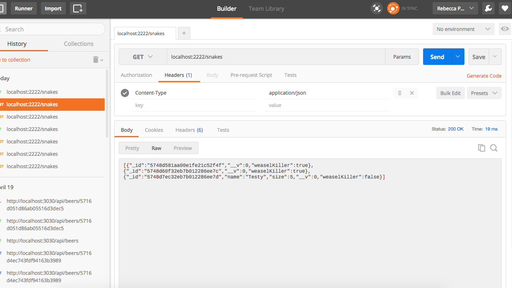
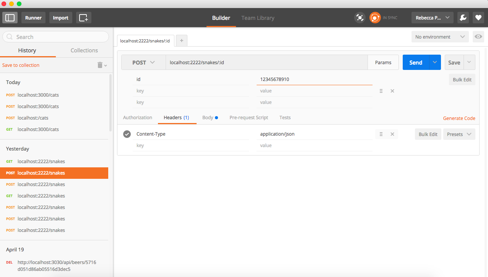
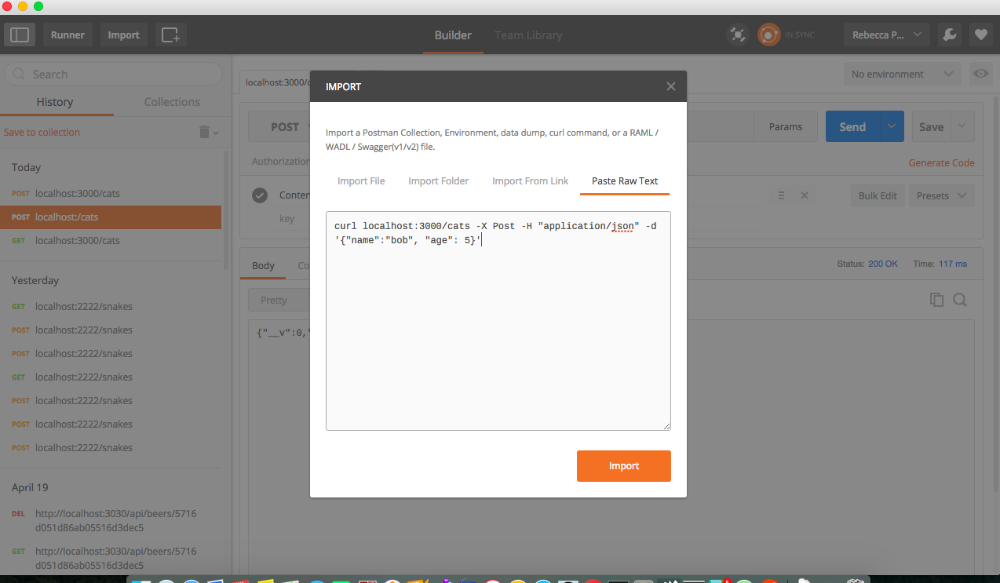

### Using Postman
To begin using Postman go to their website (https://app.getpostman.com), sign up for an account, and then download an application from the dashboard. There is a reported problem using cmd-tab to move between chrome and postman https://github.com/postmanlabs/postman-app-support/issues/833.  

For each request you need to choose a method from the method select on the left of the main section of postman.  Then key in the URL showing the path of your api.  
+ If you have params you can add the name of the param to the path (localhost:3000/snakes/:id) and then click on the Params button to enter the key value pair.
+ If you are posting you will probably need to enter 'Content-Type' as a header key and 'application/json' as the value when using the npm body-parser middleware.
+ When posting I enter the data as "raw" "text" in and then just key in a json object in the body area.
+ You can also click on import and go to the 'Past raw text' area and key in a curl statement and then Postman will fill out its form.  

There are many more features, but this should help you to test and demo your work without running into to problems with long command strings in bash.  

There are pictures below.

#### GET  

#### POST

#### showing raw json

#### showing header content type

#### showing the use of params

#### showing the use of importing curl

