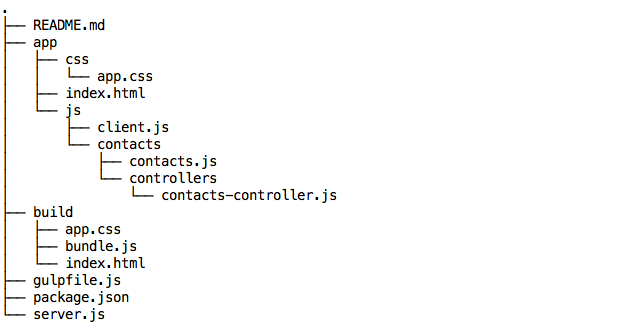

# angular-controllers

#### Setting up a controller
https://docs.angularjs.org/guide/controller

#### Specifying a controller
https://docs.angularjs.org/api/ng/directive/ngController

#Code Fellows Build  


##### client.js
Load angular code  
Instantiate and name the app  
Hand a reference to the app off to the resource  

``` javascript
const angular = require('angular');

var ContactsApp = angular.module('ContactsApp', []);
require('./contacts/contacts')(ContactsApp);

```
##### contacts.js  
Hand the app off to the controller  

``` javascript
module.exports = function(app) {
  require('./controllers/contacts-controller')(app);
};
```
#### contacts-controller.js
Tie the app to the controller
Define a function to act as controller

``` javascript
module.exports = function(app) {
  app.controller('ContactsController', ContactsController);
};
```

#### gulpfile  run: "gulp build:dev"  
var gulp = require('gulp');
var webpack = require('webpack-stream');

``` javascript
gulp.task('webpack:dev', function() {
  return gulp.src('./app/js/client.js')
    .pipe(webpack({
      output: {
        filename: 'bundle.js'
      }
    }))
    .pipe(gulp.dest('build/'));
});

gulp.task('staticfiles:dev', function() {
  return gulp.src('./app/**/*.html')
  .pipe(gulp.dest('build/'));
});

gulp.task('staticcssfiles:dev', function() {
  return gulp.src('./app/css/*.css')
  .pipe(gulp.dest('build/'));
});

gulp.task('build:dev', ['staticfiles:dev','staticcssfiles:dev', 'webpack:dev']);
gulp.task('default', ['build:dev']);
```
